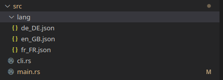

# QTranslater
This crate is a very small translation system based on Json for QMetaOjbect.
It was originally created for the translation of the [Grace software](https://gitlab.cairn-devices.eu/cairntech/grace)(by Cairn Devices).


## Objectif : 
Allow simple translation of variables for interfaces that use the [qmetaobject crate](https://github.com/woboq/qmetaobject-rs)
## Mise en place 


### In your folder project 
Create in a "lang" folder in your src folder. In this "lang" folder create a json file for every languages you want to switch to.


### In a Json file
For example in "fr_FR.json"
```json
{
    "water": "eau",
    "battery": "Batterie",
    "trains":"age",
    "global_infos": "Informations générales", 
}
```

### In your rust file
```rust
//For example: in my main.rs
//We start with import*
use qmetaobject::prelude::*; 
use qtranslation::QTranslater;

    fn main(){
        /*
        Some code...
        */
        qml_ressources(); 
        qml_register_type::<QTranslater>(cstr!("QTranslater"), 1, 0, cstr!("QTranslater")); //Register the QTranslater type
        let mut engine = QmlEngine::new();
        engine.load_file("qrc:/main/qml/main_window.qml".into()); //"main_window" is just my qml first window.But it can be any other page.
        engine.exec();

    }
    
```
### In your QML file
```qml
//Import the QTranslater object
import QTranslater 1.0

ApplicationWindow{
    id:my_window
    visible:true
    width : 800
    height:800

    QTranslater{
        id: lang //Assign an ID you want
        Component.onCompleted: {
            init();
        }
    }
    //Some code...
    ColumnLayout{
        Text{
            text: lang.dict["global_informations"]
        }
        Text{
            text: lang.dict["water"]
        }
        Text{
            text: lang.dict["battery"] + ": 23
            font.bold: true
        }

        Text{
            textFormat: Text.RichText
            text: "<html> <span style='font-weight: bold '>I love</span><span>" +lang.dict.["trains"] + +"</span><\html>"
            color: ""
            font.family: ubuntu_regular.name
        }
        
        Button{
            text: "Change to French"
            onClicked: lang.change_lang("fr_FR") // To change language
        }
    } 
}


```


